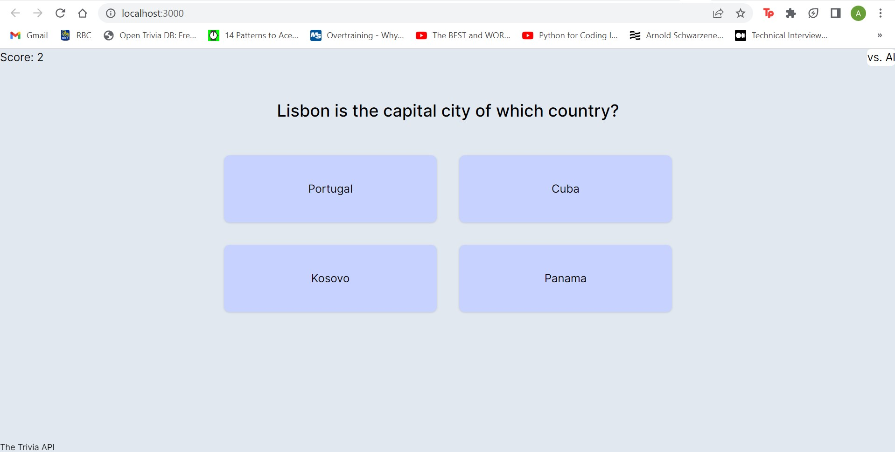

# EndlessTrivia

A web app that gives a constant stream of multiple choice trivia questions and keeps track of your score. Also includes TriviaBot, who answers all of your trivia questions.

Built using React, Tailwind and Node.js, along with the [OpenAI](https://platform.openai.com/docs/introduction) and [The Trivia API](https://the-trivia-api.com/docs/v2) APIs.

## Screenshots

|EndlessTrivia|
|:-----------:|
||

|TriviaBot|Answer|
|:-------:|:----:|
|||


### Build Instructions

1. Clone the repository.
2. Run `npm install` to install the dependencies.
3. Run `npm run serve` to run the backend.
4. Open a new terminal and run `npm start` and open the app in [http://localhost:3000](http://localhost:3000)

### Using TriviaBot

1. Retrieve [OpenAI](https://platform.openai.com/docs) secret key.
2. Create a `.env` file in the project folder like below and replace `secret-key` with your secret key.

```
OPENAI_API_KEY='secret-key'

module.exports.OPENAI_API_KEY = OPENAI_API_KEY;
```

## WIP

- versus AI mode (try and guess faster than TriviaBot!)
- multiplayer mode
